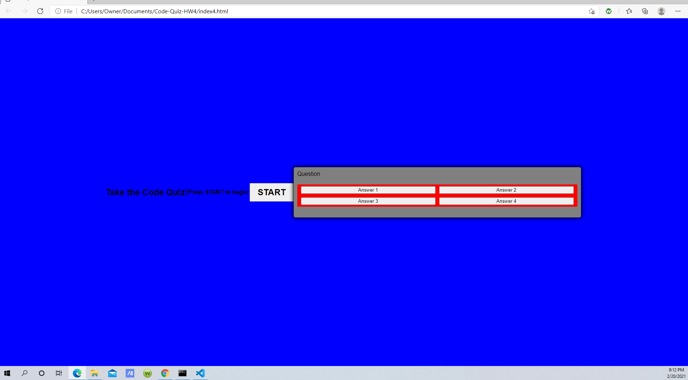

# Code-Quiz-

Purpose
The purpose of this project was to create a code quiz
game from scratch and make it functional. I failed at 
this task, although I actually did try hard to complete
it.

Tasks Completed
The css, html, and javasript files were all created in order
complete the task. However, getting them to work together in
any meaningful way eluded me.

Closing
In closing, the code quiz homework got the better of me, 
although I tried to make the pieces fir together. When I 
have more time, I shall certainly resubmit it as a finished
and working product.

It can be found here

https://rgivens21.github.io/Code-Quiz-HW4/

